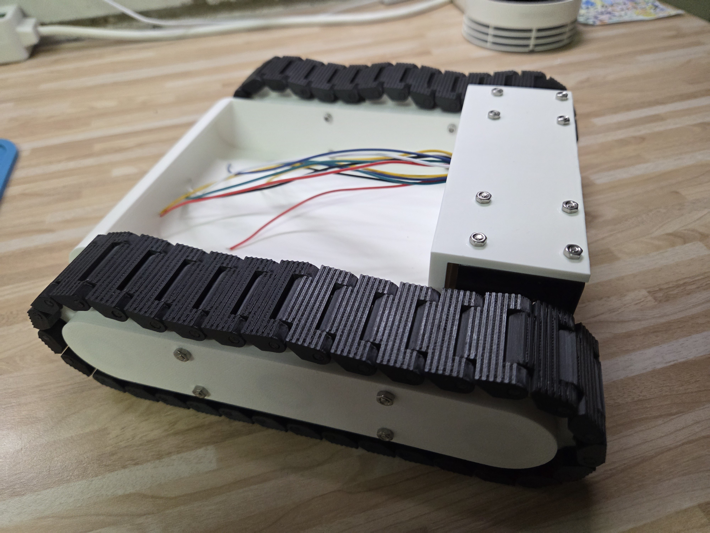
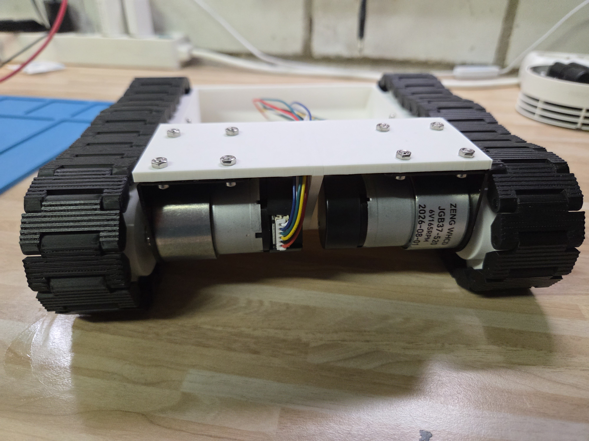
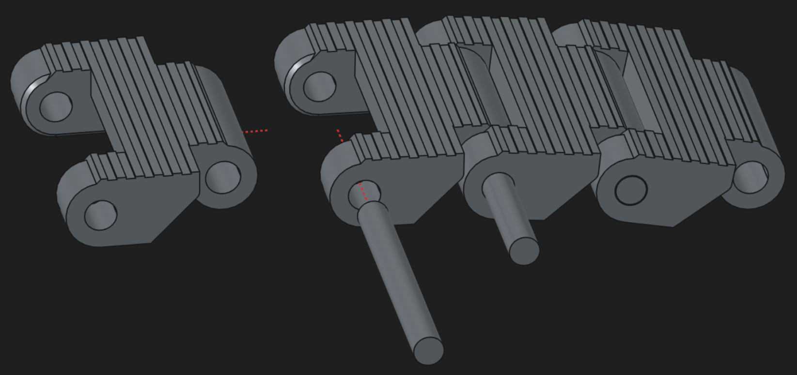
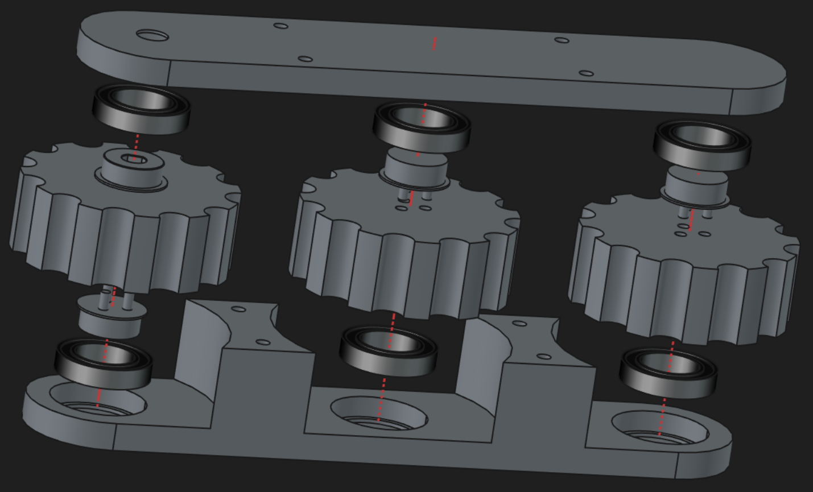

# explorer-robot

Evolving project for a tracked robot platform with LiDAR-based
autonomous navigation and sensor-driven obstacle avoidance.

Built in Rust on [Embassy](https://embassy.dev/) for the RP2350 microcontroller.
This iteration builds on hardware experience from [simple-robot](https://github.com/1-rafael-1/simple-robot), adding a
360° spinning LiDAR (COIN-D6), a VL53L0X rangefinder (front-down), ICM-20948 IMU over
SPI, a ST7789 TFT display, and a Grove Vision AI V2 camera module — as much as I can manage on custom PCB hardware. The ultrasonic/servo sweeping sensor array is ditched, and so are the IR sensors.

## Status

Active development. Core subsystems (drive, perception, UI, calibration) are
implemented with synthetic sensor stubs. Real sensor drivers are planned.

The big to-dos, in no particular order:

- [x] Make a new chassis to accommodate the new motors and ball bearings.
- [x] Make a D6 lidar driver
- [x] Make an async tft driver
- [ ] Integrate the D6 lidar driver into the firmware
- [ ] Integrate the tft driver into the firmware
- [ ] Make an async-capable VL53L0X driver and integrate that
- [ ] Make a new schematic adapting from simple-robot
- [ ] Full breadboard demonstrator to see if the firmware is botched
- [ ] Make an async Grove Vision AI V2 driver and integrate that
- [ ] Design a new PCB from that. Depending on how mad I feel, maybe ditch some dev boards in favor of an SMD design.

## Hardware

- **MCU:** Raspberry Pi RP2350B (dual-core Cortex-M33)
- **Motors:** 2× JGB37-520 6V DC with Hall encoders, 165 RPM
- **Bearings:** 12× 6802-2RS (DIN 625; a.k.a. 61802-2RS)
- **Motor driver:** TB6612FNG dual H-bridge
- **LiDAR:** COIN-D6 360° spinning dTOF (core1, UART0 [] power MOSFET reserved, currently stubbed)
- **AI Cam:** Grove Vision AI V2 (core0, UART1 [] power MOSFET reserved, not yet integrated)
- **Rangefinder:** 1× VL53L0X ToF, front-down (stair/drop detection), on shared I2C0 bus (currently stubbed)
- **IMU:** ICM-20948 9-axis over dedicated SPI bus
- **Display:** ST7789 240×240 TFT over SPI
- **Input:** EC11 rotary encoder with push button
- **Power:** 2S LiPo (8.4V max)

## Assembly

The chassis and running gear are my first CAD design at this level of
complexity. It works as I planned, but I fully expect to find reasons to change,
add, or remove parts as I go. I've printed it in PLA on a 0.4 mm nozzle at
variable layer height with good results — after running the motors for an hour
straight on a riser, nothing looked worn or abraded, there was no PLA dust
anywhere, and all the track pins were still in place.

### Parts required

Purchased:

- 2× JGB37-520 motors (with encoders)
- 2× matching motor brackets (often sold with the motors)
- 12× 6802-2RS ball bearings (6 per track)
- 8× M3 8 mm screws
- 8× M3 40 mm screws
- 16× M3 nuts

Printed:

- 1× chassis main part
- 2× inner track pod parts
- 2× outer track pod parts
- 2× driven sprockets
- 4× freewheeling sprockets
- 6× sprocket holders (one per sprocket)
- 64× track links (32 per track)
- 64× track link pins

### Track assembly

### Track pod assembly

### Overall assembly

### Assembly tips

- The driven sprocket's D-shaft hole is a very tight fit on the motor's D-shaft.
  Push the sprocket onto the shaft at least once before final assembly — the real
  assembly later will be much easier.
- The bearings have to be pressed into the pod shells with some force. Keep them
  even, since everything is a tight fit. I used a rubber mallet, gently.
- After each step, check that the sprockets turn freely in the pod without
  scraping. The screws — combined with the pressure needed to fit the D-shaft —
  can introduce enough strain that something ends up slightly off, causing wobble
  and scraping. It does fit in the end, but takes a little patience.
- The 8 mm screws can be fiddly to get in — use tweezers. After a few minutes of
  colorful cursing they'll go in.

## License

MIT
